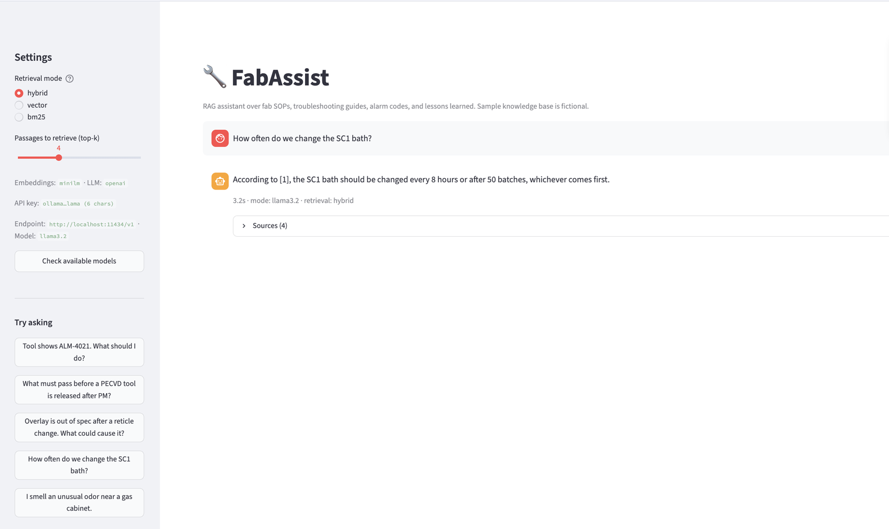
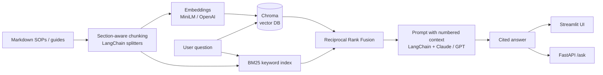

# RAG Troubleshooting Assistant: FabAssist and OpsAssist

One hybrid-retrieval RAG pipeline, three knowledge bases you can switch between in the app:

| Profile | For | Documents |
|---|---|---|
| **FabAssist** (`fab`) | Semiconductor fab engineers and technicians | Fictional SOPs, alarm codes, SPC rules, lessons learned (`data/fab/`) |
| **OpsAssist** (`it`) | IT / network operations | Fictional switch, DHCP, DNS, backup, change-management runbooks, syslog reference, postmortems (`data/it/`) |
| **My documents** (`private`) | Your own work | Anything you drop in `data/private/` (md, txt, pdf, docx, html), **never pushed to GitHub** |

FabAssist answers fab engineers' and technicians' questions ("Tool shows ALM-4021, what do I do?", "Overlay is out of spec after a reticle change") from a knowledge base of SOPs, troubleshooting guides, alarm-code references and lessons-learned reports. Every answer cites the passages it came from.

It is built as a forward-deployed prototype: quick to stand up, measurable, and structured so it could be handed to an IT or MLOps team for production.

**Live demo:** [fab-rag-assistant.streamlit.app](https://fab-rag-assistant-5cbn4sjjp4ntn6toyayd8s.streamlit.app) (runs in retrieval-only mode, with no LLM key, showing cited passages). The full generative version runs locally with a free open-source model via Ollama: see [Run it on your Mac](#run-it-on-your-mac-step-by-step).



### FabAssist results (28 labeled questions, MiniLM embeddings, Llama 3.2 via Ollama)

| Retrieval | Doc Hit@1 | Doc Hit@3 | Section Hit@3 | MRR | Hit@3 (exact ID lookups) |
|---|---|---|---|---|---|
| Vector only | 96% | 96% | 86% | 0.96 | 83% |
| BM25 only | 89% | 100% | 96% | 0.95 | 100% |
| **Hybrid (RRF)** | **100%** | **100%** | **100%** | **1.00** | **100%** |

Hybrid retrieval fixed the cases each method missed on its own: vector search missed exact alarm-code and document-ID lookups, and BM25 missed paraphrased questions at rank 1.

| Generation check | Result |
|---|---|
| Answers that include citations | 82% |
| Correct "not found" on out-of-scope questions | 100% (2 of 2) |
| Average latency (local Llama 3.2, Apple Silicon) | 1.7 s |

### OpsAssist results (27 labeled IT questions, MiniLM embeddings, Llama 3.2 via Ollama)

| Retrieval | Doc Hit@1 | Doc Hit@3 | Section Hit@3 | MRR |
|---|---|---|---|---|
| Vector only | 89% | 100% | 100% | 0.94 |
| BM25 only | 81% | 96% | 89% | 0.90 |
| **Hybrid (RRF)** | **93%** | **100%** | **100%** | **0.96** |

Generation: 67% of answers included citations, 100% correct "not found" on out-of-scope questions, 2.4 s average latency. The lower citation rate comes from the small 3B local model sometimes answering without bracketed citations; a larger model or a citation-enforcing output format is the next fix.

*Limitations: the evaluation set is small and was written alongside the documents, so these numbers show the method works, not production accuracy. Next steps are a larger engineer-labeled set and a re-ranker.*

> The sample knowledge bases in `data/fab/` and `data/it/` are **fictional**. They were written for this project to resemble real documentation and do not describe any real organization.

## Architecture



**Design decisions**
- **Hybrid retrieval (vector + BM25 with RRF).** Engineers search by exact identifiers such as alarm codes (`ALM-4021`), document IDs and incident numbers. Embedding models blur those. BM25 catches exact matches, vectors catch paraphrases ("line width keeps moving" → CD drift), and RRF merges the two lists without tuning score scales.
- **Section-aware chunking.** Documents are split on markdown headers first, so a troubleshooting procedure stays together. Each chunk is prefixed with `[Document > Section]` so it keeps its context.
- **Grounded prompting.** The model must cite passage numbers, must not guess numeric limits, must say "I could not find this" when the answer isn't in context, and must put safety actions first.
- **Pluggable providers.** Embeddings (`minilm` local/free, `openai`, `hashing` offline) and the LLM (`anthropic`, `openai`, `none` = extractive) are set by environment variables. With `LLM_PROVIDER=none` the app runs with no API key.

## Run it on your Mac (step by step)

Everything runs on your laptop: your documents, the search, and the AI model (Llama 3.2 through Ollama). No API key, no cost, and nothing is sent to the internet.

### One-time setup (about 15 minutes)

1. **Install Ollama** (the free local AI model): download it from [ollama.com](https://ollama.com), drag it into Applications, and open it once. A llama icon appears in the menu bar.
2. **Download the model.** Open Terminal (Command + Space, type `Terminal`, press Enter) and run:
   ```bash
   ollama pull llama3.2
   ```
   Wait for `success` (about 2 GB).
3. **Download this project.** In the same Terminal window, run:
   ```bash
   cd ~ && git clone https://github.com/AmenaUril78/fab-rag-assistant.git
   ```
   If macOS asks to install "command line developer tools", click **Install**, then run the line again.

### Every time you want to use it

1. **Open the project folder:** in Finder press **Shift + Command + G**, type `~/fab-rag-assistant`, press Enter.
2. **Double-click `Start FabAssist.command`.** The very first time, right-click it, choose **Open**, then **Open** again (macOS asks once because it is a script).
   - A Terminal window opens and the app opens in your browser at `http://localhost:8501`.
   - The first launch takes a few minutes to install libraries. Later launches take seconds.
   - The launcher also downloads the latest version of the project automatically.
3. **To stop the app,** close that Terminal window.

Tip: drag `Start FabAssist.command` to your Dock or Desktop for one-click access.

### Add your documents

1. In the sidebar, **Knowledge base** should say **My documents (private)** (it is the default on your laptop).
2. Click **Your documents · add or remove** at the top of the page.
3. Drag in your runbooks: **PDF, Word (.docx), Markdown (.md), text (.txt), or HTML**.
4. That's it. Files are read automatically, and adding, editing, or removing a file (with **Remove**) updates the search on its own.

For the best answers, use documents with **one heading per problem** (for example "Port err-disabled", "Client gets 169.254 address"). Scanned PDFs (images of text) cannot be read; use the original Word or text file instead.

### Ask questions and check the answers

Type the problem the way you would describe a ticket, for example *"User gets VPN error 809 from home"*.

| What you see | What it means |
|---|---|
| An answer with **[1] [2]** citations | It came from your documents. Click **Sources** to read the original passage. |
| *"I could not find this in the knowledge base"* | Your documents don't cover it. Add a runbook that does. |
| A **yellow warning** "This answer has no citations…" | The model may have made it up. Trust only the quoted passages shown under it. |

**Always open the cited source before changing a production device.** The assistant helps you find the right runbook fast; it does not replace it.

### Switch knowledge bases

Use the **Knowledge base** menu in the sidebar:

- **My documents (private):** your own files (only on your laptop).
- **IT / network ops (demo):** fictional IT runbooks, with example questions in the sidebar.
- **Semiconductor fab (demo):** fictional fab documents, with example questions in the sidebar.

### Where your files are and who can see them

Your documents are saved in `~/fab-rag-assistant/data/private/` on your laptop only. That folder is excluded from Git (a test checks this), so it is never committed or pushed to GitHub, and it never appears on the public website. Check your organization's data policy before adding internal documents to any AI tool.

### Troubleshooting

| Problem | Fix |
|---|---|
| `Start FabAssist.command` is not in the folder | In Terminal: `cd ~/fab-rag-assistant && git pull` |
| `git pull` says *untracked working tree files would be overwritten* | Delete the file it names (for example `rm eval/results_it_minilm.md`), then run `git pull` again |
| Browser says the page can't be reached, or *Port 8501 is already in use* | An older copy is still running. Close all Terminal windows, then double-click the launcher again |
| Yellow *LLM call failed* warning | Ollama is not running. Open the Ollama app (llama icon in the menu bar). In Terminal, `ollama list` should show `llama3.2` |
| `ModuleNotFoundError` | The app was started with the wrong Python. Close Terminal and use the launcher instead of typing commands |
| A document doesn't show up in answers | Check it appears under **Your documents**. Scanned PDFs can't be read |
| Answers are vague or uncited | Ask a more specific question, add documents that cover it, or try a larger model: `ollama pull llama3.1:8b` and set `OPENAI_MODEL=llama3.1:8b` in the `.env` file |

## Developer setup (manual, any OS)

```bash
python -m venv .venv && source .venv/bin/activate      # Windows: .venv\Scripts\activate
pip install -r requirements.txt
cp .env.example .env                                   # choose Ollama, a hosted API, or LLM_PROVIDER=none

python -m fabrag.ingest --profile it     # optional: the app indexes automatically on first launch
python -m streamlit run app.py           # chat UI at http://localhost:8501
uvicorn api:app --reload                 # REST API, docs at http://localhost:8000/docs
```

LLM options (set in `.env`): Ollama or any OpenAI-compatible server via `OPENAI_BASE_URL`, hosted OpenAI or Anthropic with an API key, or `LLM_PROVIDER=none` for cited passages only. Everything (embeddings, vector search, and generation) can stay on your machine, which matters in a fab where documents often cannot leave the site.

API example:
```bash
curl -X POST localhost:8000/ask -H "Content-Type: application/json" \
     -d '{"question": "What do I do for ALM-4021?", "top_k": 4}'
```

## Evaluation

`eval/questions_fab.json` (28 questions) and `eval/questions_it.json` (27 questions) contain paraphrased "semantic" questions plus "exact-ID" lookups (alarm codes, syslog mnemonics, exception names, document IDs). Each one is labeled with the expected document and section.

```bash
python -m eval.run_eval --profile fab              # retrieval metrics: vector vs BM25 vs hybrid
python -m eval.run_eval --profile it --generate    # also citation rate, out-of-scope abstention, latency
```

Metrics are Doc Hit@1, Doc Hit@3, Section Hit@3 and MRR, broken down by question type. Results are written to `eval/results_<embedding>.md`.

## Tests

```bash
pytest -q     # runs fully offline: hashing embeddings + extractive mode, includes FastAPI endpoint tests
```

## Project layout

```
fabrag/config.py      profiles (fab, it, private) and settings from env vars
fabrag/embeddings.py  MiniLM (ONNX) / OpenAI / hashing embeddings behind LangChain's Embeddings interface
fabrag/ingest.py      load md/txt/pdf/docx/html → section-aware chunk → embed → Chroma
fabrag/rag.py         BM25, RRF hybrid retrieval, grounded prompt, LLM call, extractive fallback
app.py                Streamlit chat UI: knowledge-base switcher, rebuild index, source viewer, retrieval-mode toggle
api.py                FastAPI: /health, /ask, /search
eval/                 labeled question set + evaluation script
tests/                pytest suite
data/fab/             fictional fab knowledge base (9 documents)
data/it/              fictional IT / network ops knowledge base (9 documents)
data/private/         your own documents (git-ignored)
```

## Path to production (what I'd do next)

- Connect real document sources (SharePoint/Confluence) with incremental re-indexing on document change.
- Enforce document-level access control by filtering on metadata at retrieval time.
- Add a cross-encoder re-ranker and run evaluation on a larger, engineer-labeled question set.
- Log questions, retrieved chunks and user feedback (thumbs up/down) to find gaps in the knowledge base.
- Containerize (Docker), add CI that runs `pytest` and the retrieval eval, and fail the build if Hit@3 regresses.
