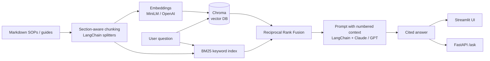

# FabAssist: RAG Troubleshooting Assistant for Semiconductor Fabs

FabAssist answers fab engineers' and technicians' questions ("Tool shows ALM-4021, what do I do?", "Overlay is out of spec after a reticle change") from a knowledge base of SOPs, troubleshooting guides, alarm-code references and lessons-learned reports. Every answer cites the passages it came from.

It is built as a forward-deployed prototype: quick to stand up, measurable, and structured so it could be handed to an IT or MLOps team for production.

**Live demo:** [fab-rag-assistant.streamlit.app](https://fab-rag-assistant-5cbn4sjjp4ntn6toyayd8s.streamlit.app) (runs in retrieval-only mode, with no LLM key, showing cited passages). The full generative version runs locally with a free open-source model via [Ollama](#run-fully-local-with-ollama-no-api-key).


### Results (28 labeled questions, MiniLM embeddings, Llama 3.2 via Ollama)

| Retrieval | Doc Hit@1 | Doc Hit@3 | Section Hit@3 | MRR | Hit@3 (exact ID lookups) |
|---|---|---|---|---|---|
| Vector only | 96% | 96% | 86% | 0.96 | 83% |
| BM25 only | 89% | 100% | 96% | 0.95 | 100% |
| **Hybrid (RRF)** | **100%** | **100%** | **100%** | **1.00** | **100%** |

Hybrid retrieval fixed the cases each method missed on its own: vector search missed exact alarm-code and document-ID lookups, and BM25 missed paraphrased questions at rank 1.

| Generation check | Result |
|---|---|
| Answers that include citations | 82% |
| Correct "not found" on out-of-scope questions | 100% (2 of 2) |
| Average latency (local Llama 3.2, Apple Silicon) | 1.7 s |

*Limitations: the evaluation set is small and was written alongside the documents, so these numbers show the method works, not production accuracy. Next steps are a larger engineer-labeled set and a re-ranker.*

> The sample knowledge base in `data/docs/` is **fictional**. It was written for this project to resemble real fab documentation. Swap in your own documents to reuse the pipeline.

## Architecture



**Design decisions**
- **Hybrid retrieval (vector + BM25 with RRF).** Engineers search by exact identifiers such as alarm codes (`ALM-4021`), document IDs and incident numbers. Embedding models blur those. BM25 catches exact matches, vectors catch paraphrases ("line width keeps moving" → CD drift), and RRF merges the two lists without tuning score scales.
- **Section-aware chunking.** Documents are split on markdown headers first, so a troubleshooting procedure stays together. Each chunk is prefixed with `[Document > Section]` so it keeps its context.
- **Grounded prompting.** The model must cite passage numbers, must not guess numeric limits, must say "I could not find this" when the answer isn't in context, and must put safety actions first.
- **Pluggable providers.** Embeddings (`minilm` local/free, `openai`, `hashing` offline) and the LLM (`anthropic`, `openai`, `none` = extractive) are set by environment variables. With `LLM_PROVIDER=none` the app runs with no API key.

## Quickstart

```bash
python -m venv .venv && source .venv/bin/activate      # Windows: .venv\Scripts\activate
pip install -r requirements.txt
cp .env.example .env                                   # add your ANTHROPIC_API_KEY (or set LLM_PROVIDER=none)

python -m fabrag.ingest          # chunk + embed + store in ./chroma_db (first run downloads MiniLM, ~80 MB)
streamlit run app.py             # chat UI at http://localhost:8501
uvicorn api:app --reload         # REST API, docs at http://localhost:8000/docs
```

### Run fully local with Ollama (no API key)

1. Install [Ollama](https://ollama.com) and run `ollama pull llama3.2`.
2. Put this in `.env`:
   ```
   LLM_PROVIDER=openai
   OPENAI_BASE_URL=http://localhost:11434/v1
   OPENAI_API_KEY=ollama
   OPENAI_MODEL=llama3.2
   EMBEDDING_PROVIDER=minilm
   ```
3. `python -m streamlit run app.py`

Everything (embeddings, vector search, and generation) stays on your machine, which matters in a fab where documents often cannot leave the site. Any OpenAI-compatible endpoint works the same way by changing `OPENAI_BASE_URL`.

API example:
```bash
curl -X POST localhost:8000/ask -H "Content-Type: application/json" \
     -d '{"question": "What do I do for ALM-4021?", "top_k": 4}'
```

## Evaluation

`eval/questions.json` has 28 labeled questions: paraphrased "semantic" questions plus "exact-ID" lookups (alarm codes, document IDs, incident numbers). Each one is labeled with the expected document and section.

```bash
python -m eval.run_eval              # retrieval metrics for vector vs BM25 vs hybrid
python -m eval.run_eval --generate   # also checks citation rate, abstention on out-of-scope questions, latency
```

Metrics are Doc Hit@1, Doc Hit@3, Section Hit@3 and MRR, broken down by question type. Results are written to `eval/results_<embedding>.md`.

## Tests

```bash
pytest -q     # runs fully offline: hashing embeddings + extractive mode, includes FastAPI endpoint tests
```

## Project layout

```
fabrag/config.py      settings from env vars
fabrag/embeddings.py  MiniLM (ONNX) / OpenAI / hashing embeddings behind LangChain's Embeddings interface
fabrag/ingest.py      load → section-aware chunk → embed → Chroma
fabrag/rag.py         BM25, RRF hybrid retrieval, grounded prompt, LLM call, extractive fallback
app.py                Streamlit chat UI with source viewer and retrieval-mode toggle
api.py                FastAPI: /health, /ask, /search
eval/                 labeled question set + evaluation script
tests/                pytest suite
data/docs/            fictional fab knowledge base (9 documents)
```

## Path to production (what I'd do next)

- Connect real document sources (SharePoint/Confluence) with incremental re-indexing on document change.
- Enforce document-level access control by filtering on metadata at retrieval time.
- Add a cross-encoder re-ranker and run evaluation on a larger, engineer-labeled question set.
- Log questions, retrieved chunks and user feedback (thumbs up/down) to find gaps in the knowledge base.
- Containerize (Docker), add CI that runs `pytest` and the retrieval eval, and fail the build if Hit@3 regresses.
